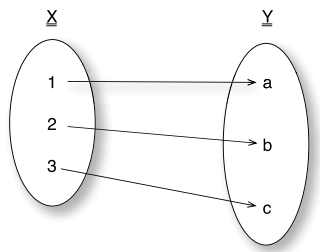

#### 1.1.2 Scala是一种函数式语言

有些读者可能对函数式编程语言并不熟悉，所以在描述它之前，我会先对函数式编程进行定义。
函数式编程是一种把计算当成数学函数求值，并且避免使用状态和可变数据的编程范式。

> **可变（mutable）和不可变（immutable）数据**

> 可以通过引用来改变被引用对象的内容的对象，是可变对象。
不能通过引用改变被引用对象的内容的对象，是不可变对象。

> 创建可变对象非常容易，你只需提供对这个对象可变状态的访问接口即可。
可变对象的优点是可以追踪到状态变化。
在多线程环境中，你需要使用锁/同步技术来避免并发访问引起的相关问题。
而对于不可变对象来说，这些问题都是不存在的。

函数式编程与数学相近，在它的世界观里，程序是由函数组成的，这些函数接受某些输入，产出对应输出（这些输入和输出也可能是函数）。
函数式编程的构建单元即不是对象（OOP风格），也不是过程（procedure，C语言风格），而是函数。
用函数进行编程，这是对函数式编程的一个简单定义。

理解函数的概念是非常重要的。
函数即是把定义域中每个值（input）都分别映射成值域中的某一个值（output）。
图1.1描述的是函数把定义域X中值，映射成值域Y中的某一个值。

***图1.1 将X中值映射成Y某一个值的纯函数***

> **怎样将数学中的函数与编程中的函数建立对应关系？**

> 在数学中，函数关联一组被称为定义域（在编程中被称为输入）的元素到一组被称为值域（编程中被称为输出）的元素。
函数把定义域中的每个元素都精确映射到值域中的某一个值。如：`f(x) = y`可以被解释为*x与y有一个f关系，或者x通过f映射到y*。

> 如果在编写函数时脑子里时刻装着数学函数的定义，那么你写出的函数对于给定的输入总是会得到相同的输出。

> 让我们用程序进一步说明。假如你有一个函数，它包括两个输入参数，以求和做为输出。如下：

> `def addFunction(a: Int, b： Int) = a + b`

> 对于一个给定的输入`set(2, 3)`，这个函数总是返回`5`。反之，下面的这个`currentTime`函数并不适合于这个定义：

> `def currentTime(timezone: TimeZone) = Calendar.getInstance(timezone).getTime`

> 对于给定的参数timezone，它总是根据当天时间的不同返回不同的结果。

> 数学函数的另一个有意思的特性是*引用透明*（referential transparency），这意味着一个表达式可以被它的结果替代。
在`addFunction`的例子中，我们可以在所有对这个函数调用的地方用它的输出结果替代之，此时，程序的表现是不会被改变的。

函数式编程的另一个方面是它没有副作用（side effect）和可变性（mutability）。
没有可变性和副作用的好处是函数式风格的程序更容易理解（没有副作用），由此可知，测试会变的非常活跃高效，因为函数都是本地的，没有其它外部影响。
另一个巨大的好处是函数式编程给并发编程带来很多便利。因为对所有进程和线程来说，所有东西都是不可变的，所以并发最大的难点被解决了。
在学习Scala的同时，并发编程的内容会贯穿本书，尤其是第10章。

> **副作用（side effect）**

> 当一个函数或表达式除了产出一个值之外，还修改一些状态，或者与调用它的函数或外界产生可见交互，那么这个函数就是有副作用的。
一个函数可能修改一个全局或静态变量、修改它的参数、抛异常、打印终端或写入文件、读取数据，或者调用其它有副作用的函数，这些行为都是有副作用的。
一个函数有副作用与否，取决于它的执行历史。

现在让我们讨论下函数式编程语言。函数式编程语言必须至少支持以下几个特性：
- 高阶函数（Higher-order funcation）（第4章）
- 闭包（Lexical closure）(第3章)
- 模式匹配（pattern matching）（第2章和第3章）
- 唯一赋值（single assignment）（第2章）
- 延迟计算（lazy evaluation）（第2章）
- 类型推断（type inference）（第2章）
- 尾部调用优化（tail call optimization）（第5章）
- List表达式（第2章和第4章）
- Mondadic effects（第5章）

如果你之前没有接触过函数式编程，你可能对上面的一些特性并不熟悉。
Scala支持其中的大部分，简单起见，Scala是一种把函数当做头等值（first-class value）的函数式编程语言。
这意味着，在Scala中每个函数都是一个值（比如整数1或者字符串"f"）。
和其它的值一样，你可以把函数本身作为参数传递，或者作为其它函数的返回值。

>**Scala是纯函数式语言吗？**

>简而言之，Scala并不是纯函数式语言。在纯函数式语言的字典里，根本就没有修改这个词，变量和数学中一样，是被标识符引用的不可变的固定值。
Haskell是一种纯函数式语言。

>Scala同时支持两种类型的变量：唯一赋值变量（也被称为值（value）），即在它的生命周期中不可变的变量；可变变量，即可以改变状态或被分配其它对象的变量。
虽然你可以在任何时候都使用不可变对象，但这并不是Scala在语言层面上硬性规定的，这只是一种惯例层面的限制。
一种比较好的做法是，总是默认使用val，在非用不可时，才使用可用对象。

>对我来说，函数式语言的基本特性是把函数当作值，在这一点上，Scala上做的很好。

在Scala中，你可以把一个函数`(x: Int) => x + 1`赋值给一个val引用，并且用这个引用来触发对这个函数的调用：

    val inc = (x: Int) => x + 1
    inc(1)

上例中，val表示的一个唯一赋值变量（与Java中的final变量类似）。这种变量在被分配值之后，是不能够被改变的。这个函数调用的结果是`2`。

在下面的例子中，你可以观察到怎样把一个函数做为参数传递给另一个函数并得到结果：

    List(1, 2, 3).map((x: Int) => x + 1)

我们向一个`map`函数传递了一个增量函数，`List(1, 2, 3)`对象调用 `map`函数产生的输出为`List(2, 3, 4)`。
从这个输出中我们可以分析出，`map`对list中的每个元素都调用了这个增量函数。
现在不必担心语法问题，我们将在后续章节中对此进行详细讲解。

## 链接
- [目录](../README.md)
- 下一节: [1.1.3 Scala是一种多范式语言](1.1.1.3.md)
